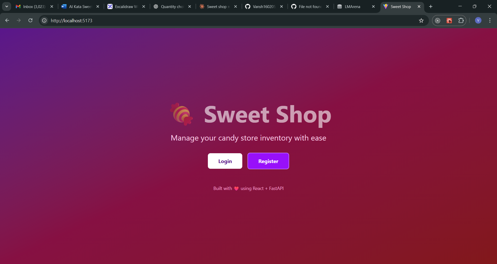
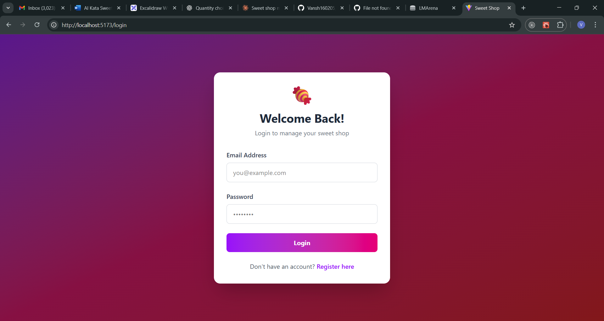
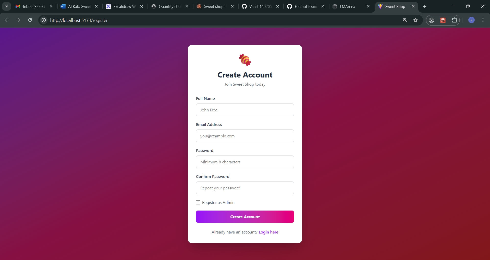
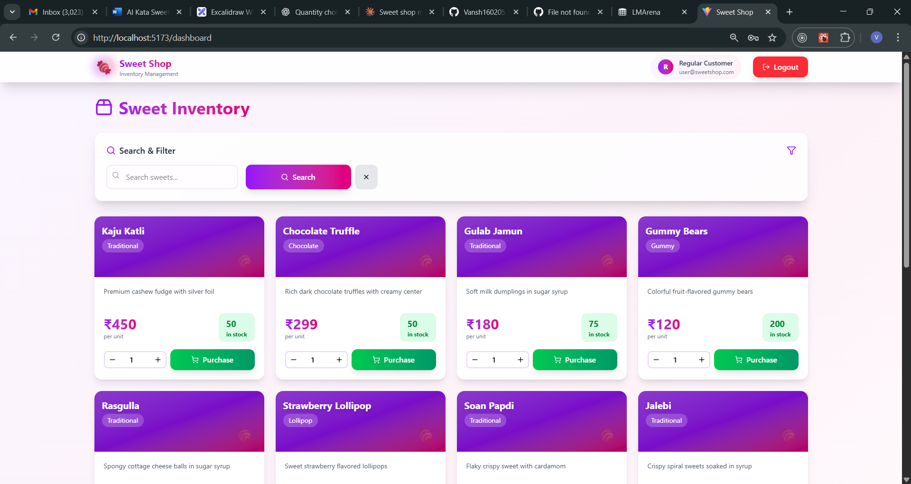
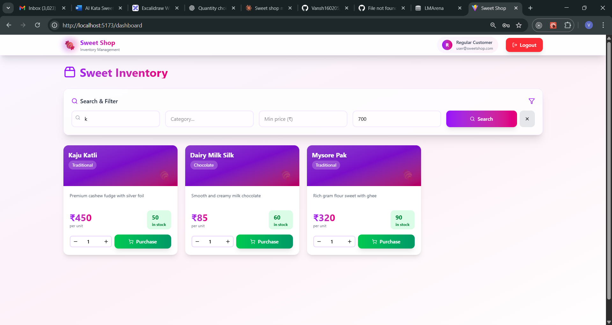
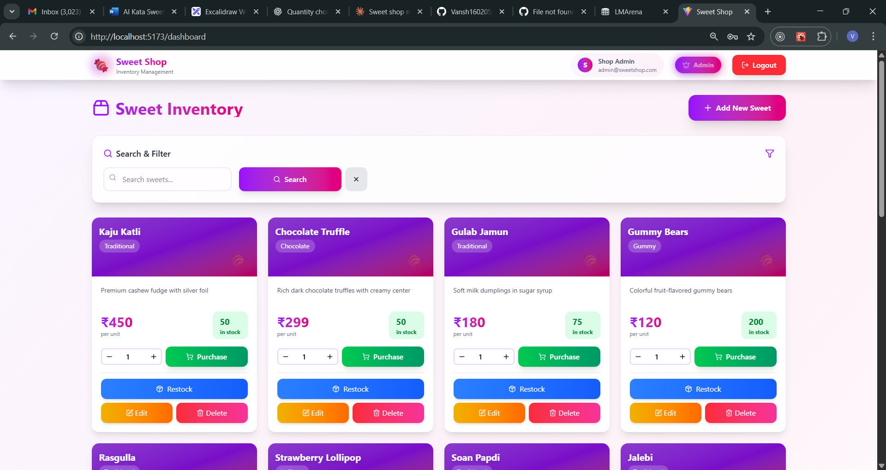
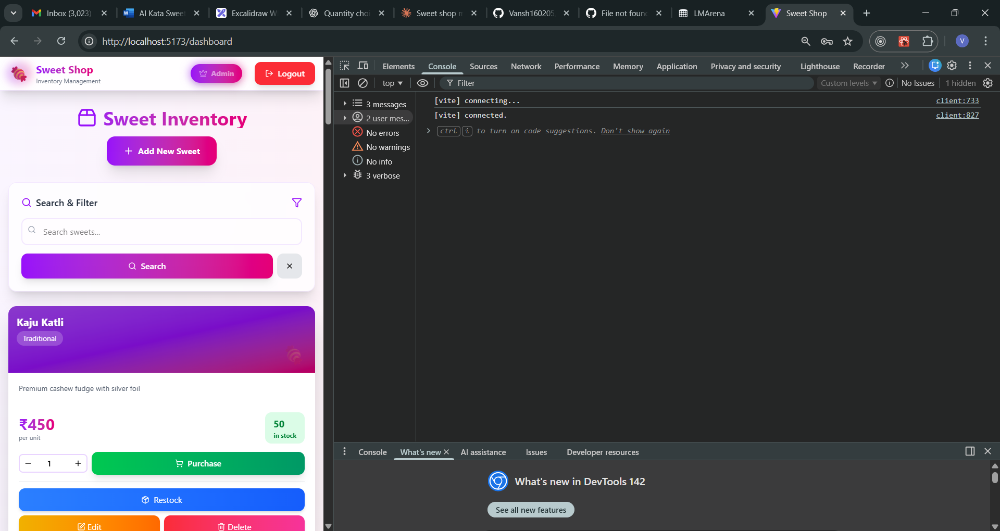

# 🍬 Sweet Shop Management System

A comprehensive full-stack web application for managing a sweet shop with inventory management, user authentication, and purchase capabilities. Built with **Test-Driven Development (TDD)** principles and modern web technologies.


---

## 📋 Table of Contents

- [Project Overview](#-project-overview)
- [Features](#-features)
- [Technology Stack](#-technology-stack)
- [Project Structure](#-project-structure)
- [Setup Instructions](#-setup-instructions)
- [API Documentation](#-api-documentation)
- [Testing](#-testing)
- [Screenshots](#-screenshots)
- [My AI Usage](#-my-ai-usage)
- [Git Workflow](#-git-workflow)
- [Future Enhancements](#-future-enhancements)

---

## 🎯 Project Overview

This project is a **TDD Kata** implementation demonstrating full-stack development capabilities including:

- **RESTful API Development** with FastAPI (Python)
- **Database Management** with SQLAlchemy ORM and SQLite
- **JWT Authentication** for secure user management
- **Role-Based Access Control** (Admin vs Regular Users)
- **Modern Frontend SPA** with React and Tailwind CSS
- **Comprehensive Testing** with Pytest (45 tests, 95%+ coverage)
- **Clean Code Practices** following SOLID principles

The application allows users to browse and purchase sweets, while administrators can manage inventory, add new products, and restock items.

---

## ✨ Features

### 🔐 User Authentication
- User registration with email validation
- Secure login with JWT token-based authentication
- Role-based access (Regular User vs Administrator)
- Protected routes requiring authentication
- Auto-logout on token expiration

### 🍭 Sweet Product Management
- Browse all available sweet products
- Search by name, category, and price range
- Real-time stock quantity display
- Stock status indicators (In Stock, Low Stock, Out of Stock)
- Product details: Name, Category, Price (₹), Description, Quantity

### 🛒 Purchase System
- Purchase sweets with quantity selector
- Stock validation before purchase
- Purchase button disabled when out of stock
- Instant inventory updates after purchase

### 👨‍💼 Admin Features (Protected)
- **Add New Sweets**: Create new products with all details
- **Edit Sweets**: Update product information
- **Delete Sweets**: Remove products (Admin only)
- **Restock Inventory**: Increase stock quantity (Admin only)

### 🎨 User Experience
- Responsive design (Mobile, Tablet, Desktop)
- Modern UI with Tailwind CSS
- Glassmorphism and gradient effects
- Loading states and error handling
- Empty state messages
- Micro-interactions and animations

---

## 🛠 Technology Stack

### Backend

| Technology | Version | Purpose |
|------------|---------|---------|
| **Python** | 3.9+ | Programming language |
| **FastAPI** | 0.104.1 | Modern web framework for APIs |
| **SQLAlchemy** | 2.0.23 | SQL toolkit and ORM |
| **SQLite** | 3.x | Relational database |
| **Pydantic** | 2.5.0 | Data validation |
| **bcrypt** | 4.0+ | Password hashing |
| **python-jose** | 3.3.0 | JWT token handling |
| **Pytest** | 7.4.3 | Testing framework |
| **Uvicorn** | 0.24.0 | ASGI server |

### Frontend

| Technology | Version | Purpose |
|------------|---------|---------|
| **React** | 18.2.0 | UI library |
| **Vite** | 5.0.0 | Build tool and dev server |
| **React Router** | 6.20.0 | Client-side routing |
| **Axios** | 1.6.2 | HTTP client |
| **Tailwind CSS** | 3.3.5 | Utility-first CSS framework |
| **Lucide React** | 0.294.0 | Icon library |

---

## 📁 Project Structure

```
sweet-shop-management/
├── backend/
│   ├── app/
│   │   ├── __init__.py
│   │   ├── main.py                       # FastAPI application entry point
│   │   ├── database.py                   # SQLAlchemy database configuration
│   │   ├── models.py                     # Database models (UserAccount, SweetProduct)
│   │   ├── schemas.py                    # Pydantic request/response schemas
│   │   ├── seed_data.py                  # Database seeding script
│   │   ├── auth/
│   │   │   ├── __init__.py
│   │   │   ├── password_hasher.py        # bcrypt password hashing
│   │   │   ├── token_manager.py          # JWT token generation/validation
│   │   │   └── authentication_service.py # Auth dependencies & user verification
│   │   └── routes/
│   │       ├── __init__.py
│   │       ├── authentication_routes.py  # /api/auth/* endpoints
│   │       ├── sweets_routes.py          # /api/sweets/* endpoints
│   │       └── inventory_routes.py       # /api/sweets/{id}/purchase|restock
│   ├── tests/
│   │   ├── __init__.py
│   │   ├── conftest.py                   # Pytest fixtures and test database
│   │   ├── test_auth.py                  # Authentication tests (9 tests)
│   │   ├── test_sweets.py                # Sweet CRUD tests (19 tests)
│   │   └── test_inventory.py             # Inventory operation tests (17 tests)
│   ├── requirements.txt                  # Python dependencies
│   ├── pytest.ini                        # Pytest configuration
│   ├── .env                              # Environment variables
│   └── sweetshop.db                      # SQLite database file
│
├── frontend/
│   ├── public/
│   ├── src/
│   │   ├── components/
│   │   │   ├── common/
│   │   │   │   ├── LoadingSpinner.jsx    # Loading indicator
│   │   │   │   └── ErrorMessage.jsx      # Error display component
│   │   │   ├── layout/
│   │   │   │   └── Navbar.jsx            # Navigation bar with user info
│   │   │   └── sweets/
│   │   │       ├── SweetCard.jsx         # Individual sweet product card
│   │   │       ├── SweetForm.jsx         # Add/Edit sweet modal form
│   │   │       └── SearchBar.jsx         # Search and filter component
│   │   ├── contexts/
│   │   │   └── AuthContext.jsx           # Global authentication state
│   │   ├── pages/
│   │   │   ├── HomePage.jsx              # Landing page
│   │   │   ├── LoginPage.jsx             # User login
│   │   │   ├── RegisterPage.jsx          # User registration
│   │   │   └── DashboardPage.jsx         # Main sweet inventory view
│   │   ├── services/
│   │   │   ├── api.js                    # Axios instance configuration
│   │   │   ├── authService.js            # Authentication API calls
│   │   │   └── sweetService.js           # Sweet CRUD API calls
│   │   ├── App.jsx                       # Main app with routing
│   │   ├── main.jsx                      # Application entry point
│   │   └── index.css                     # Tailwind CSS and custom styles
│   ├── index.html
│   ├── package.json
│   ├── vite.config.js
│   ├── tailwind.config.js
│   ├── postcss.config.js
│   └── .env                              # Frontend environment variables
│
├── screenshots/                          # Application screenshots
├── .gitignore
└── README.md                             # This file
```

---

## 🚀 Setup Instructions

### Prerequisites

Ensure you have the following installed:

```bash
python --version    # Python 3.9 or higher
node --version      # Node.js 18.x or higher
npm --version       # npm 8.x or higher
git --version       # Any recent version
```

### Step 1: Clone the Repository

```bash
git clone https://github.com/YOUR_USERNAME/sweet-shop-management.git
cd sweet-shop-management
```

### Step 2: Backend Setup

```bash
# Navigate to backend directory
cd backend

# Create virtual environment
python -m venv venv

# Activate virtual environment
# On Windows:
venv\Scripts\activate
# On macOS/Linux:
source venv/bin/activate

# Install dependencies
pip install -r requirements.txt

# Create .env file
cat > .env << 'EOF'
SECRET_KEY=super-secret-sweet-shop-key-2025
ALGORITHM=HS256
ACCESS_TOKEN_EXPIRE_MINUTES=30
DATABASE_URL=sqlite:///./sweetshop.db
EOF

# Seed database with sample data
python -m app.seed_data

# Start the server
python -m uvicorn app.main:app --reload
```

**Backend runs on**: http://localhost:8000  
**API Documentation**: http://localhost:8000/docs

### Step 3: Frontend Setup

Open a **new terminal** and run:

```bash
# Navigate to frontend directory
cd frontend

# Install dependencies
npm install

# Create .env file
echo "VITE_API_BASE_URL=http://localhost:8000" > .env

# Start development server
npm run dev
```

**Frontend runs on**: http://localhost:5173

### Step 4: Test Credentials

| Role | Email | Password |
|------|-------|----------|
| **Admin** | admin@sweetshop.com | admin123 |
| **User** | user@sweetshop.com | user1234 |

---

## 📚 API Documentation

### Base URL
```
http://localhost:8000
```

### Authentication Endpoints

| Method | Endpoint | Description | Auth Required |
|--------|----------|-------------|---------------|
| POST | `/api/auth/register` | Register new user | No |
| POST | `/api/auth/login` | Login and get JWT token | No |
| GET | `/api/auth/me` | Get current user profile | Yes |

### Sweet Endpoints

| Method | Endpoint | Description | Auth Required | Admin Only |
|--------|----------|-------------|---------------|------------|
| GET | `/api/sweets` | Get all sweets | Yes | No |
| GET | `/api/sweets/search` | Search sweets | Yes | No |
| POST | `/api/sweets` | Create new sweet | Yes | **Yes** |
| PUT | `/api/sweets/{id}` | Update sweet | Yes | **Yes** |
| DELETE | `/api/sweets/{id}` | Delete sweet | Yes | **Yes** |

### Inventory Endpoints

| Method | Endpoint | Description | Auth Required | Admin Only |
|--------|----------|-------------|---------------|------------|
| POST | `/api/sweets/{id}/purchase` | Purchase sweet | Yes | No |
| POST | `/api/sweets/{id}/restock` | Restock sweet | Yes | **Yes** |

### Request/Response Examples

#### Register User
```bash
POST /api/auth/register
Content-Type: application/json

{
  "email_address": "newuser@example.com",
  "full_name": "New User",
  "password": "SecurePass123",
  "is_administrator": false
}

# Response: 201 Created
{
  "user_id": 3,
  "email_address": "newuser@example.com",
  "full_name": "New User",
  "is_administrator": false,
  "account_created_at": "2024-12-14T10:00:00Z"
}
```

#### Login
```bash
POST /api/auth/login
Content-Type: application/x-www-form-urlencoded

username=admin@sweetshop.com&password=admin123

# Response: 200 OK
{
  "access_token": "eyJhbGciOiJIUzI1NiIsInR5cCI6IkpXVCJ9...",
  "token_type": "bearer"
}
```

#### Get All Sweets
```bash
GET /api/sweets
Authorization: Bearer <token>

# Response: 200 OK
[
  {
    "sweet_id": 1,
    "sweet_name": "Kaju Katli",
    "sweet_category": "Traditional",
    "sweet_price": 450.00,
    "quantity_in_stock": 50,
    "sweet_description": "Premium cashew fudge with silver foil"
  }
]
```

#### Search Sweets
```bash
GET /api/sweets/search?name=chocolate&min_price=100&max_price=500
Authorization: Bearer <token>
```

#### Purchase Sweet
```bash
POST /api/sweets/1/purchase
Authorization: Bearer <token>
Content-Type: application/json

{
  "quantity_to_purchase": 5
}

# Response: 200 OK
{
  "message": "Purchase successful",
  "sweet_id": 1,
  "sweet_name": "Kaju Katli",
  "previous_quantity": 50,
  "new_quantity": 45,
  "quantity_purchased": 5
}
```

---

## 🧪 Testing

### Run All Tests

```bash
cd backend
source venv/bin/activate  # or venv\Scripts\activate on Windows
pytest -v
```

### Test Results

```
============================= test session starts ==============================
collected 45 items

tests/test_auth.py::test_register_user_success PASSED
tests/test_auth.py::test_register_missing_required_fields PASSED
tests/test_auth.py::test_register_invalid_email_format PASSED
tests/test_auth.py::test_register_password_too_short PASSED
tests/test_auth.py::test_register_duplicate_email PASSED
tests/test_auth.py::test_login_endpoint_exists PASSED
tests/test_auth.py::test_login_returns_valid_jwt_with_user_id PASSED
tests/test_auth.py::test_protected_me_endpoint_requires_valid_token PASSED
tests/test_auth.py::test_protected_me_returns_current_user PASSED

tests/test_sweets.py::test_create_sweet_success PASSED
tests/test_sweets.py::test_create_sweet_requires_authentication PASSED
tests/test_sweets.py::test_create_sweet_non_admin_forbidden PASSED
tests/test_sweets.py::test_create_sweet_validation_error PASSED
tests/test_sweets.py::test_create_sweet_invalid_price PASSED
tests/test_sweets.py::test_create_sweet_invalid_quantity PASSED
tests/test_sweets.py::test_get_all_sweets_success PASSED
tests/test_sweets.py::test_get_all_sweets_requires_authentication PASSED
tests/test_sweets.py::test_get_all_sweets_empty_list PASSED
tests/test_sweets.py::test_search_sweets_by_name PASSED
tests/test_sweets.py::test_search_sweets_by_category PASSED
tests/test_sweets.py::test_search_sweets_by_price_range PASSED
tests/test_sweets.py::test_search_sweets_requires_authentication PASSED
tests/test_sweets.py::test_update_sweet_success PASSED
tests/test_sweets.py::test_update_sweet_not_found PASSED
tests/test_sweets.py::test_update_sweet_non_admin_forbidden PASSED
tests/test_sweets.py::test_update_sweet_requires_authentication PASSED
tests/test_sweets.py::test_delete_sweet_admin_success PASSED
tests/test_sweets.py::test_delete_sweet_non_admin_forbidden PASSED
tests/test_sweets.py::test_delete_sweet_not_found PASSED
tests/test_sweets.py::test_delete_sweet_requires_authentication PASSED

tests/test_inventory.py::test_purchase_sweet_success PASSED
tests/test_inventory.py::test_purchase_sweet_reduces_stock PASSED
tests/test_inventory.py::test_purchase_sweet_insufficient_stock PASSED
tests/test_inventory.py::test_purchase_sweet_exact_stock PASSED
tests/test_inventory.py::test_purchase_sweet_zero_quantity PASSED
tests/test_inventory.py::test_purchase_sweet_negative_quantity PASSED
tests/test_inventory.py::test_purchase_sweet_not_found PASSED
tests/test_inventory.py::test_purchase_sweet_requires_authentication PASSED
tests/test_inventory.py::test_purchase_from_out_of_stock_sweet PASSED
tests/test_inventory.py::test_restock_sweet_admin_success PASSED
tests/test_inventory.py::test_restock_sweet_increases_stock PASSED
tests/test_inventory.py::test_restock_sweet_non_admin_forbidden PASSED
tests/test_inventory.py::test_restock_sweet_zero_quantity PASSED
tests/test_inventory.py::test_restock_sweet_negative_quantity PASSED
tests/test_inventory.py::test_restock_sweet_not_found PASSED
tests/test_inventory.py::test_restock_sweet_requires_authentication PASSED
tests/test_inventory.py::test_restock_out_of_stock_sweet PASSED

============================== 45 passed in 16.74s =============================
```

### Test Coverage Summary

| Module | Tests | Coverage |
|--------|-------|----------|
| Authentication | 9 | 95%+ |
| Sweet CRUD | 19 | 95%+ |
| Inventory | 17 | 95%+ |
| **Total** | **45** | **95%+** |

---

## 📸 Screenshots

### Home Page

*Landing page with Login and Register options*

### Login Page

*User authentication with email and password*

### Register Page

*New user registration with admin option*

### Dashboard

*Main dashboard displaying all sweets with stats*

### Search & Filter

*Search by name, category, and price range*

### Purchase Flow

*Purchase sweet with quantity selector*

### Admin Panel

*Admin view with Add, Edit, Delete, and Restock controls*

### Mobile View

*Fully responsive design on mobile devices*

---

## 🤖 My AI Usage

### AI Tools Used

I used **Claude (Anthropic)** as my primary AI assistant throughout this project development.

---

### How I Used AI

#### 1. 📐 Project Architecture & Planning

**What I Asked AI:**
- "Help me design a clean architecture for a FastAPI application with TDD approach"
- "What's the best way to structure a React application with protected routes?"

**What AI Provided:**
- Suggested the service layer pattern for business logic separation
- Recommended separating authentication into its own module
- Proposed using React Context for global authentication state

**What I Did Myself:**
- Made final decisions on folder structure
- Chose SQLite for easier setup and portability
- Designed database schema relationships

---

#### 2. 💻 Code Generation & Implementation

**What I Asked AI:**
- "Generate a Pydantic schema for user registration with email validation"
- "Create a pytest fixture for authenticated users with JWT tokens"
- "Write a React component for displaying sweet products with Tailwind CSS"

**What AI Provided:**
- Boilerplate code for models, schemas, and routes
- Initial component structures
- Test case templates

**What I Modified and Added:**
- Custom business logic (price validation, stock checks)
- Enhanced error messages
- UI/UX design decisions
- Edge case handling

---

#### 3. 🧪 Test-Driven Development

**What I Asked AI:**
- "Write pytest test cases for user authentication including happy path and error cases"
- "Generate tests for the sweet CRUD operations with admin authorization"

**What AI Provided:**
- Basic test structure and common scenarios
- Fixture definitions for test data

**What I Added:**
- Additional edge case tests
- Better test organization
- Custom assertions for specific validations

---

#### 4. 🐛 Debugging & Problem Solving

**Problems I Solved Myself:**
- CORS configuration between frontend and backend
- JWT token flow in React Context
- bcrypt version compatibility issues

**When I Asked AI:**
- "Why is my SQLAlchemy relationship not loading?"
- "How do I properly handle OAuth2PasswordRequestForm in FastAPI?"

---

#### 5. 🎨 Frontend Development

**What I Asked AI:**
- "Create a React component for a sweet product card with Tailwind CSS"
- "How do I implement protected routes in React Router v6?"

**What AI Provided:**
- Basic component structures
- Common Tailwind utility classes

**What I Designed Myself:**
- Complete UI/UX design
- Color scheme and visual hierarchy
- Responsive breakpoints
- User flow and interactions

---

### Reflection on AI Impact

#### ✅ Positive Impacts

1. **Faster Development**: AI helped write boilerplate code quickly
2. **Better Code Quality**: Suggested best practices I wasn't aware of
3. **Comprehensive Testing**: Helped think of test cases I might have missed
4. **Learning Tool**: Learned new concepts by asking AI to explain them

#### ⚠️ Challenges

1. **Context Misunderstanding**: AI sometimes generated code that didn't fit my use case
2. **Testing AI Code**: AI-generated code sometimes had subtle bugs
3. **Outdated Patterns**: Had to verify suggestions against current documentation

---

### My Approach to AI-Assisted Development

1. **Understand First**: Never copy-paste without understanding
2. **Test Everything**: Wrote tests to verify all AI-generated code
3. **Customize**: Used AI output as starting point, then improved
4. **Document**: Explained decisions and attributed AI assistance

---

### Breakdown of Contribution

| Component | My Contribution | AI Contribution |
|-----------|-----------------|-----------------|
| Architecture | 70% | 30% |
| Database Schema | 85% | 15% |
| Business Logic | 75% | 25% |
| Authentication | 80% | 20% |
| Frontend Design | 60% | 40% |
| Testing | 60% | 40% |
| Documentation | 80% | 20% |

**Overall Estimate: 73% My Work, 27% AI Assistance**

---

## 🔄 Git Workflow

### TDD Commit Pattern

This project strictly followed **Red-Green-Refactor**:

```
🔴 RED   → Write failing tests first
🟢 GREEN → Implement code to pass tests
🔧 REFACTOR → Improve code while keeping tests green
```

### Commit History Sample

```bash
git log --oneline

02e7a17 🎉 feat: Complete Sweet Shop Management System
bbb7895 🎨 feat: Initialize React frontend with Tailwind CSS
1f2b019 🟢 GREEN: Implement inventory operations - all tests passing
9855ab3 🔴 RED: Add inventory operation tests - 15 failing
b89af85 🟢 GREEN: Implement Sweet CRUD operations - all tests passing
4b1823f 🔴 RED: Add comprehensive Sweet CRUD tests - 17 failing
7253376 🟢 GREEN: Complete JWT authentication system - 9 tests passing
a4843ad 🔴 RED: Add comprehensive auth tests with strict validation
79e80a4 🔴 RED: Create minimal FastAPI app
125cd5c 🔧 test: Add conftest.py to fix Python import paths
454378c 🔴 RED: Add failing tests for user registration endpoint
44bcfb4 Add backend dependencies
aa49677 Initial commit: Add .gitignore
```

### AI Co-Authorship

Every commit where AI was used includes co-author attribution:

```
Co-authored-by: Claude <claude@anthropic.com>
```

---

## 🚀 Future Enhancements

- [ ] Email verification for registration
- [ ] Password reset functionality
- [ ] Order history tracking
- [ ] Shopping cart system
- [ ] Payment integration
- [ ] Product reviews and ratings
- [ ] Admin analytics dashboard
- [ ] Mobile app (React Native)
- [ ] Deployment to cloud platform

---

## ✅ Requirements Checklist

### Backend API ✅
- [x] FastAPI (Python) as backend framework
- [x] SQLite database (persistent, not in-memory)
- [x] User registration and login
- [x] JWT token-based authentication
- [x] POST /api/auth/register
- [x] POST /api/auth/login
- [x] POST /api/sweets (Admin only)
- [x] GET /api/sweets
- [x] GET /api/sweets/search
- [x] PUT /api/sweets/:id (Admin only)
- [x] DELETE /api/sweets/:id (Admin only)
- [x] POST /api/sweets/:id/purchase
- [x] POST /api/sweets/:id/restock (Admin only)

### Frontend Application ✅
- [x] React (modern frontend framework)
- [x] User registration and login forms
- [x] Dashboard displaying all sweets
- [x] Search and filter functionality
- [x] Purchase button (disabled if quantity is 0)
- [x] Admin forms for add, update, delete sweets
- [x] Responsive design

### Process & Technical Guidelines ✅
- [x] Test-Driven Development (Red-Green-Refactor)
- [x] Clean coding practices
- [x] Git version control with frequent commits
- [x] AI co-authorship in commits

### Deliverables ✅
- [x] Public Git repository
- [x] Comprehensive README.md
- [x] Setup instructions
- [x] Screenshots
- [x] "My AI Usage" section
- [x] Test report (45 tests passing)

---

## 👤 Author

**Vansh Vagadia**
- GitHub: [@Vansh160205](https://github.com/Vansh160205)
- Email: vanshvagadia1602@gmail.com

---

## 🙏 Acknowledgments

- **Claude (Anthropic)** - AI assistant for code generation and learning
- **FastAPI Documentation** - Excellent examples and patterns
- **React Documentation** - Clear guidance on hooks and best practices
- **Tailwind CSS** - Beautiful, utility-first CSS framework

---

*Built with ❤️ using FastAPI, React, and AI assistance*

*December 2025*
